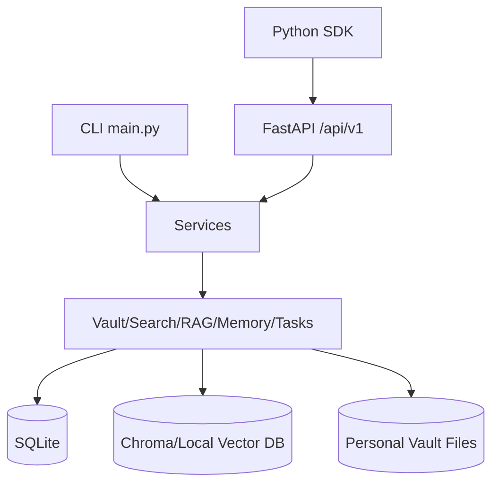
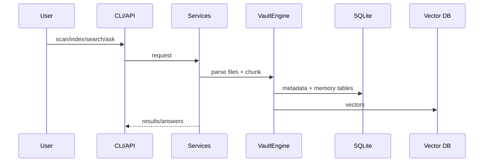
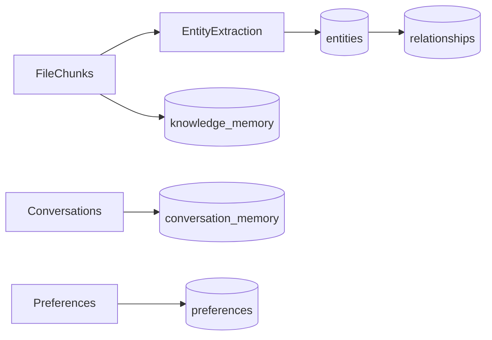

# ARCHITECTURE

## Purpose
Document system design, data flow, and component boundaries.

## Audience
Developers, architects, and maintainers.

## Prerequisites
Basic Python and REST API familiarity.

## Step-by-step (System Overview)

## Folder structure
- `app/api` API layer
- `app/services` service layer
- `app/database` schema/bootstrap
- `app/search` hybrid retrieval
- `app/rag` answer generation pipeline
- `app/memory` long-term memory
- `app/knowledge_graph` entities/relationships/timeline
- `app/tools` tool framework
- `app/plugins` plugin runtime
- `app/agents`, `app/tasks`, `app/workflows` orchestration

## Data flow

## Memory flow

## RAG pipeline
retrieve -> rank -> context build -> provider/fallback answer -> citations + confidence.

## Agent/Tool/Plugin framework
- Agent registry auto-discovers `BaseAgent` classes.
- Tool registry auto-discovers `BaseTool` classes.
- Plugin loader validates and loads plugin tools.

## REST API
FastAPI app in `app/api/server.py`; routes under `app/api/routes`.

## Database schema
Primary tables include `files`, `file_text`, `file_metadata`, `entities`, `relationships`, `projects`, `timelines`, `conversation_memory`, `knowledge_memory`, `tasks`, `agent_history`, `tools`, `plugins`, `api_keys`, `api_requests`, `service_metrics`, `service_health`, `api_audit_log`, `schema_migrations`.

## Configuration flow
`.env` -> `app/config/settings.py` -> `create_system()` -> services/routes.

## Examples
See API docs at `/docs` while server is running.

## Troubleshooting
If startup fails, inspect `settings_validation_report` via `python main.py` default summary.

## Related documents
- [SERVICE_ARCHITECTURE.md](SERVICE_ARCHITECTURE.md)
- [DEVELOPER_GUIDE.md](DEVELOPER_GUIDE.md)
- [API_REFERENCE.md](API_REFERENCE.md)
